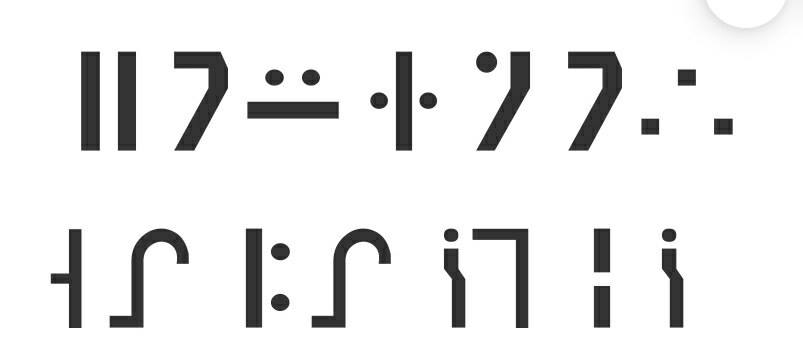
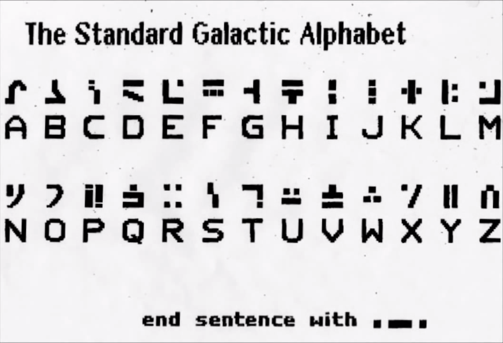

## ⚡ [Aliens](https://ctf.hcmus.edu.vn/challenges#Aliens)

Tác giả: `pakkunandy`

Tags: `cyptography` 

### Challenge Description

Đề cho 2 hình ảnh : 

Chúng ta cần tìm flag từ 2 hình ảnh này.

### Summary

Nếu nghi ngờ về kỹ thuật ẩn giấu thông tin trong file ảnh thì chúng ta có thể check sơ qua bằng các công cụ về Steganography. Nhưng với bài về Cryptography thì nên suy nghĩ về hướng giải các mật mã từ đề đưa ra. Có thể suy đoán được hình ảnh chứa dòng ký tự lạ là nội dung cần tìm và hình ảnh còn lại là gợi ý. Để giải được các bài với các ký tự lạ, chúng ta có thể tìm sơ qua các thể loại bảng ký hiệu như vậy bằng từ khóa 'Alphabet code'. 

### Exploit

Thật may mắn với mình là những ký hiệu này mình đã biết (là do trước kia mình đã giải mã chúng trong tựa game Minecraft) nên việc giải mã là điều khá đơn giản với bảng mã Galactic Alphabet:

Ra từ khóa YOUKNOWGALACTIC, lắp thêm vào cấu trúc flag là xong!

📫 Flag: **`HCMUS-CTF{}`**

---
*[Back to table of contents](../README.md)*
