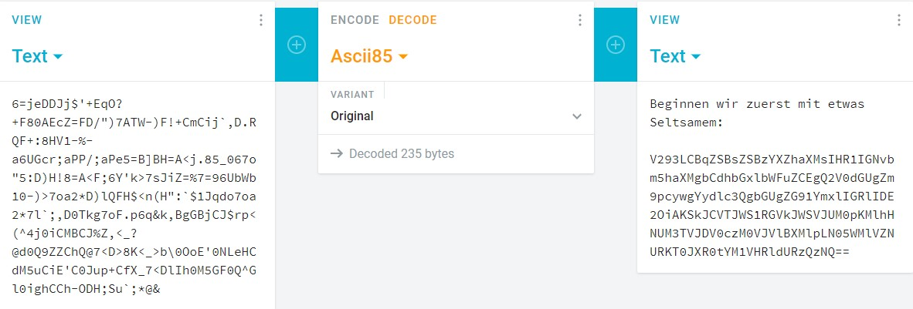
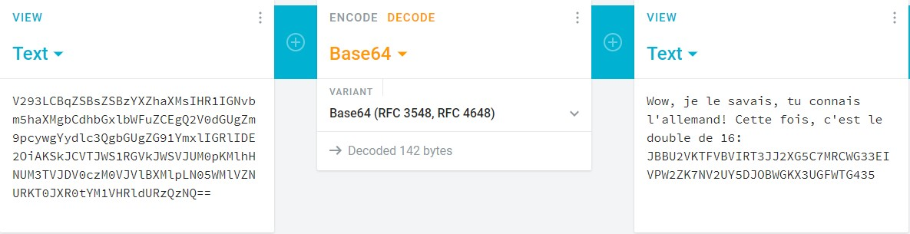
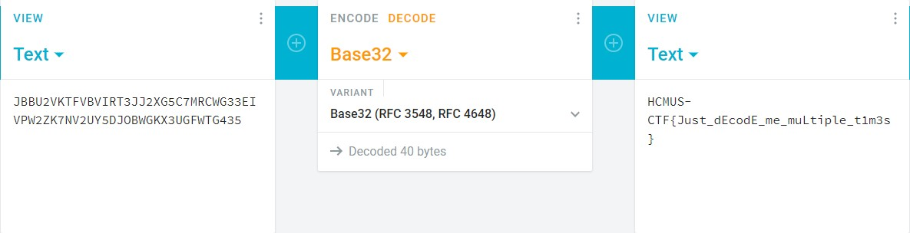

## ⚡ [NoobEncoding](https://ctf.hcmus.edu.vn/challenges#Quelcome)

Tác giả: `pakkunandy`

Tags: `cryptography` 

### Challenge Description
Đề bài cho một file coded với gợi ý: "Bạn biết bao nhiêu thứ tiếng?"

[coded](./coded)

### Summary
Mở file lên thì ta thấy 2 dòng chữ, dịch dòng đầu tiên bằng google dịch ta được: 

Vậy việc cần làm là decoded đoạn dưới theo kiểu ASCII 85 và ta được:

Lại phải google dịch đoạn đầu tiên và ta biết lần này là encode dạng base64.

Vậy ta tiến hành decode:

@@ Thêm một thứ tiếng nữa. Sau khi google dịch thì ta có được gợi ý là gấp đôi 16. Vậy ta lại mang chuỗi đi decode ở dạng base32:

Finally!! Cuối cùng thi ta cũng đã tìm được flag.

📫 Flag: **`HCMUS-CTF{Just_dEcodE_me_multiple_tim3s}`**

---
*[Back to table of contents](../README.md)*
