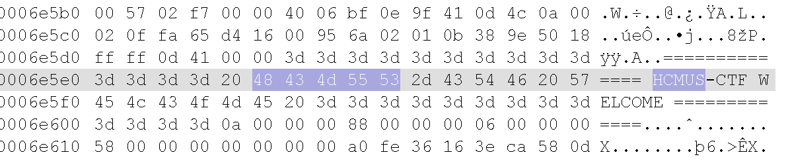
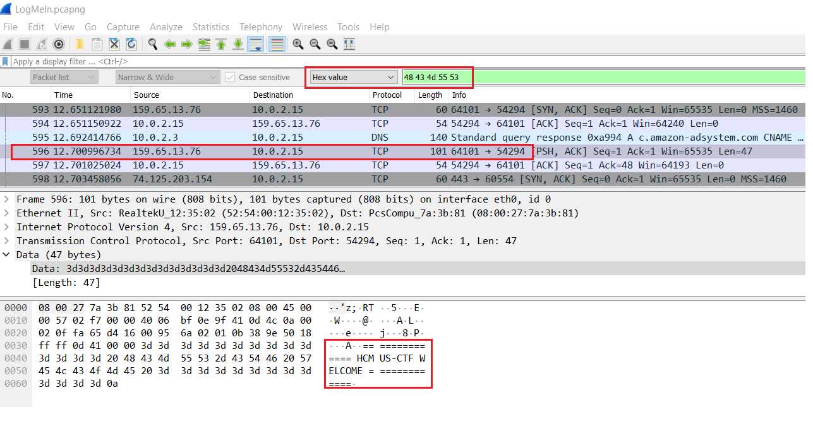

## ⚡ [HandShake](https://ctf.hcmus.edu.vn/challenges#HandShake)

[](https://img.shields.io/badge/B3T4-shark-brightgreen.svg)
[](https://img.shields.io/badge/member-viplazy-brightgreen.svg)
[](https://img.shields.io/badge/150-pts-brightgreen.svg)

Tác giả: `pakkunandy`


Tags: `forensics` `web` `pwn` `crypto`


### Challenge Description

Đề bài cho một bản ghi của quá trình client kết nối đến server, cùng với đó là các giao tác, bảo mật cần thiết để thực hiện quá trình đăng nhập.

[LogMeIn.pcapng](./LogMeIn.pcapng)

### Summary

Địa chỉ IP và Port của server có thể được tìm thấy thông qua record này.
Mở file bằng [WireShark](https://www.wireshark.org/), ta dễ dàng thấy các gói tin được gửi trong mạng.

Mở file record này trên **Hex Editor** và tìm một vài từ khóa:



Sao chép chuỗi hexa `48 43 4d 55 53` và đưa lại vào **WireShark** để tìm gói tin chứa nó.



Gói tin đó vừa được gửi từ server có địa chỉ IP và Port là `159.65.13.76:64101`

Ta tiếp tục phân tích các gói tin truyền qua lại giữa server này và client tuy nhiên không tìm được thông tin hữu ích. Thay vào đó, vì server vẫn còn đang uptime nên ta có thể kết nối trực tiếp tới server luôn.

```bash
nc 159.65.13.76 64101
```

Server sẽ trả về mỗi *session* một giá trị `nonce` ngẫu nhiên có 5 chữ số, đồng thời yêu cầu ta nhập lại một mật khẩu với format:

```python
payload = "hcmusctf-" + nonce + "-" + ran_number
```
Với `ran_number` là một số ngẫu nhiên sao cho thuật toán hash **`sha256(payload)`** trả ra kết quả có 2 byte đầu tiên là 0x0.  

Thời gian `timeout` của server là **30 seconds**

### Exploit

Với thời gian timeout ngắn như vậy, ta không thể tìm bằng tay một con số thỏa yêu cầu được. Thay vào đó, ta viết một đoạn chương trình tự động giao tác với server để nhận `nonce`, sau đó tìm một `payload` phù hợp rồi gửi lên server để nhận flag.

### Code

```python
#!/usr/bin/env python3

from hashlib import sha256
from binascii import hexlify
from pwn import *

# hash bytearray of text to SHA256Digest (return bytearray too)
def SHA256Digest(text):
    digest = sha256(text).digest()

    # we dont have to return a hex printalbe version of this hash
    #return hexlify(digest)
    
    return digest
    
p = remote("159.65.13.76", 64101) 
print(p.recvuntil("nonce: ")) 

# receive nonce from server's response
nonce = p.recv(5)

print("[+] My nonce detected: ", int(nonce)) 
print(p.recvuntil("continue!")) 

# create payload pattern 
payload = "hcmusctf-" + nonce.decode() + "-"

# scan for all number which have length of 5
for i in range(10000, 100000):
    payload1 = payload + str(i)
    bts = SHA256Digest(bytearray(payload1, 'utf-8'))
    
    # check correct answer before send to server
    if (bts[0] == 0 and bts[1] == 0):
        print("correct num: ", i)

        # Correct, capture the flag!
        p.sendline(payload1)
        p.interactive()

```


📫 Flag: **`HCMUS-CTF{}`**

---
*[Back to table of contents](../README.md)*
