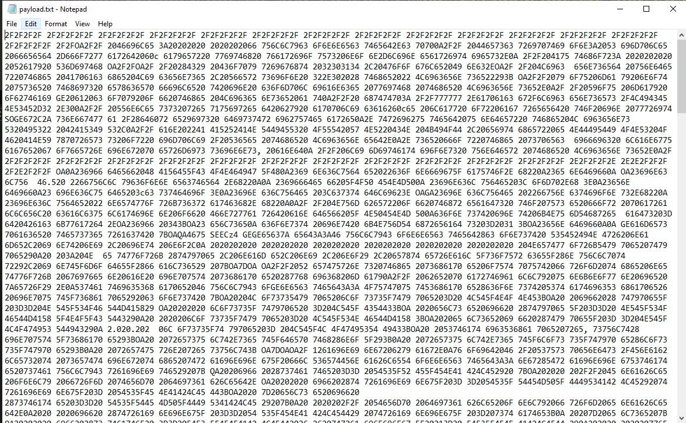
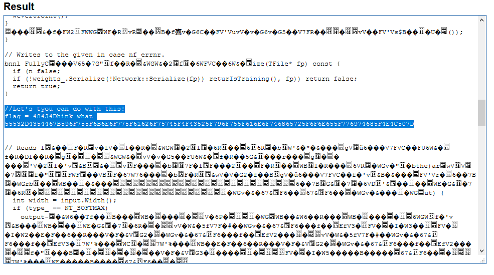
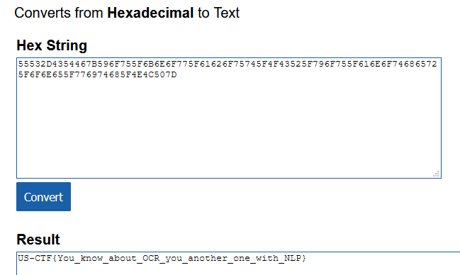

## ⚡ [OooRooCoo](https://ctf.hcmus.edu.vn/challenges#OooCooRoo)

Tác giả: `pakkunandy`

Tags: `forensics` `nlp` `decode` 

### Challenge Description

Đề cho một đường dẫn tải về 6 file hình ảnh, trong đó là các ký hiệu hex với lời dẫn: 
''' I hope you don't try to use your eyes '''
Mục tiêu là phải tìm ra flag từ trong những ký hiệu hex đó.

### Summary

Điều khó khăn đầu tiên cản trở chúng ta chính là việc làm sao để trích xuất những ký hiệu hệ 16 này ra từu hình ảnh. Như đề đã cảnh báo là chúng ta không nên dùng 'đôi mắt của mình', dễ hiểu vì việc này kém hiệu quả và tốn thời gian rất nhiều. Như vậy chúng ta cần những công cụ hỗ trợ quét các ký tự có trong hình ảnh. Ở đây chúng ta dùng... Google Dịch. 

### Exploit

Dùng ứng dụng Google Dịch trên thiết bị di động, quét hình ảnh trong hình dưới tùy chọn nhận dạng là English đễ dễ nhận ra các mặt chữ và số. Từ đó chúng ta hầu như nắm được nội dụng bên trong (một số chỗ sẽ sai sót vì thuật toán của Google Dịch không phải là tuyệt đối!), chúng ta được các giá trị:

Lên google tìm 1 trang chuyển HEX sang text để dịch một cách nhanh chóng, ở đây chúng ta dùng

 https://www.online-toolz.com/tools/text-hex-convertor.php
 
Sau khi dịch và xem qua sơ sơ, chúng ta nhận thấy điểm nghi ngờ với từ khóa 'flag':

Đem những ký hiệu có vẻ như là HEX của một chuỗi nào đó đi decode tiếp lần nữa chúng ta được:

Done!

📫 Flag: **`HCMUS-CTF{}`**

---
*[Back to table of contents](../README.md)*
