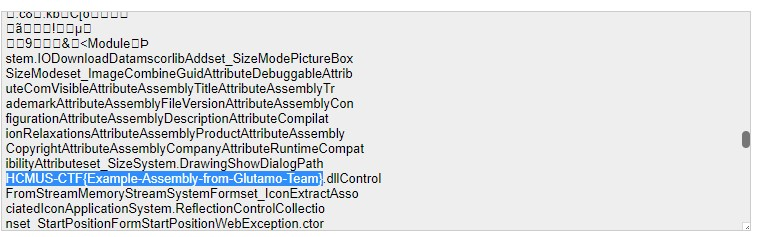

## ⚡ [OutdateBrowser](https://ctf.hcmus.edu.vn/challenges#Puzzle)

Tác giả: `danhph` `Glutamo Team`

Tags: `forensics` 

### Challenge Description

Đề bài cho ta một file main.js

[main.js](./main.js)

### Summary
Đọc file thì ta thấy được "serialized_obj" được khởi tạo rất lớn đồng thời ở dòng 415, biến "serialized_obj" được encoded bằng base64. Vậy ta thử decoded base64 tất cả chuỗi "serialized_obj".

Sau khi tìm kiếm trong chuỗi được decode, ta đã thấy được cờ

📫 Flag: **`HCMUS-CTF{Ẽample-Assembly-from-Glutamo-Team}`**

---
*[Back to table of contents](../README.md)*
