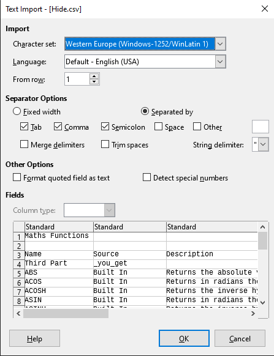

## ⚡ [RecoverMe](https://ctf.hcmus.edu.vn/challenges#RecoverMe)

[](https://img.shields.io/badge/B3T4-shark-brightgreen.svg)
[](https://img.shields.io/badge/member-noct314-brightgreen.svg)
[](https://img.shields.io/badge/150-pts-brightgreen.svg)


Tags: `forensics` `steganography` 


### Challenge Description

Đề cho một đường dẫn tải về một file img chứa dữ liệu backup. Việc cần làm là đọc file img và tìm ra flag giữa các dữ liệu ấy.

### Summary

Việc đọc 1 file img cần các công cụ hỗ trợ, ở đây chúng ta dùng AccessData_FTK_Imager. Sau khi đọc được những cấu trúc thư mục và tập tin bên trong, chúng ta cùng nhau tìm flag bị ẩn giấu.

### Exploit

Dễ dang nhất để thấy chính là file -execution.exe trong [root]/Release với nội dung:

```Second: Old_Stuff_to_help```

Như vậy có thể đoán ra flag được chia thành nhiều phần, trong đó chúng ta đã tìm ra được phần thứ 2. Tiếp tục với hình ảnh shhh.jpg đáng nghi trong [root]\Source\volatility , chúng ta dùng công cụ online https://29a.ch/photo-forensics/#strings để tìm kiếm những chuỗi ẩn trong hình ảnh và ta được: 

```Final _some_points}```

Tiếp tục với thư mục [root]\Assets có 3 file, một file âm thanh "Cake By The Ocean - DNCE.wav", "1 file deepsound.png" và 1 file "Secure-Password.jpg" chứa password. Sau khi google từ khóa "wav steganography online", chúng ta thấy được một công cụ có tên Deepsound trùng với gợi ý "deepsound.png", như vậy là xong! Bỏ file wav vào phần mềm Deepsound với mật khẩu có trong "Secure-Password.jpg", chúng ta được:

```First HCMUS-CTF{```

Vậy là còn thiếu phần third, nghi ngờ được giấu trong file Hide.xlsx. Chuyển về .csv chúng ta dễ dàng thấy được Third part:

Done!


📫 Flag: **`HCMUS-CTF{}`**

---
*[Back to table of contents](../README.md)*
