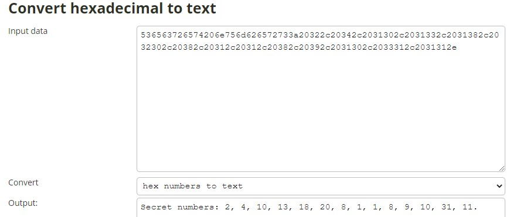
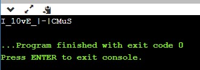

## ⚡ [Email](https://ctf.hcmus.edu.vn/challenges#Quelcome)

[](https://img.shields.io/badge/B3T4-shark-brightgreen.svg)
[](https://img.shields.io/badge/member-August23rd-brightgreen.svg)
[](https://img.shields.io/badge/100-pts-brightgreen.svg)


Tác giả: `phidang`


Tags: `programming` 


### Challenge Description
Đề bài cho một file secret.txt với gợi ý: 

```bash
Dear Mr. AndyKun,

Thank you so much for inviting me to propose a challenge for the HCMUS-CTF 2020 contest and I wish that the HCMUS-CTF 2020 contest will be hosted smoothly.

In order to get the flag in my challenge, you will need to follow the below instructions:

First, you might have to decode the secret message:

0x536563726574206e756d626572733a20322c20342c2031302c2031332c2031382c2032302c20382c20312c20312c20382c20392c2031302c2033312c2031312e

The next steps are quite simple. You will find the flag in the attachment by deleting the lines in it. A line is qualified to be deleted if all of the following rules are satisfied: - Its length (including the END LINE character) is not divisible by 5. - It does not contains the string 'Q_bug'.

Now, you can get the flag by concatenating the 'nth' characters in the remaining lines, where n are the numbers in my secret message.

That is it, this challenge is so simple, right?

Good luck and wish you all the bests!

P/s: Note that the flag has its meaning and don't forget to put your flag in the correct format before submitting it.

Sincerely, Phidang.
```

[secret.txt](./secret.txt)


### Summary
Ta chỉ cần làm theo gợi ý. Đầu tiên ta decode đoạn mã dưới dạng hex to text:



Vậy là ta đã có các số secret, bắt tay vào code như gợi ý:

```C++
int main()
{
    string line;
    int a[] = {2, 4, 10, 13, 18, 20, 8, 1, 1, 8, 9, 10, 31, 11};
    int i = 0;
    ifstream infile("secret.txt");
    while(getline(infile, line)){
        if((line.length() + 1) % 5 == 0 || line.find("Q_bug") != -1){
            cout << line[a[i]];
            i++;
        }
    }
    return 0;
}
```

Sau khi chạy thì ta có được flag:



📫 Flag: **`HCMUS-CTF{I_10vE_|-|CMuS}`**

---
*[Back to table of contents](../README.md)*
