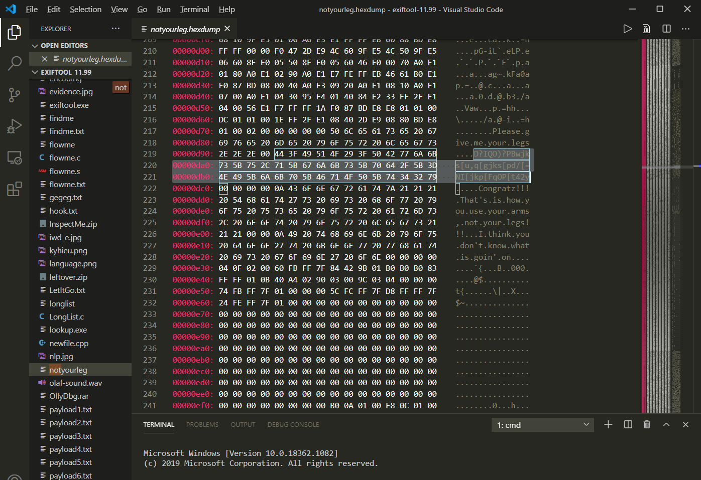
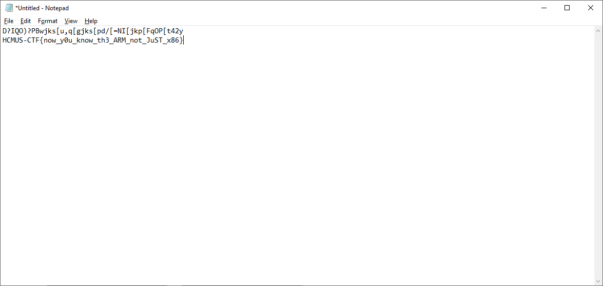

## ⚡ [NotYourLeg](https://ctf.hcmus.edu.vn/challenges#NotYourLeg)

Tác giả: `pakkunandy`

Tags: `reversing` 

### Challenge Description

Đề cho chúng ta một file thực thi và tìm flag từ file thực thi đó

### Summary

Bài dạng này yêu cầu phải chạy được file để lấy dữ kiện để đi tiếp. Rồi từ đó với truy ra được flag.

### Exploit

Tình cờ trong lúc xem sơ qua file bằng cách Show Hexdump trong Visual Studio Code, chúng ta thấy một vài câu dẫn và một đống ký hiệu đáng ngờ xem lẫn trong đó:

Vì định dạng flag là HCMUS-CTF ở đầu, ta dễ thấy có 2 vị trí chữ C đứng đúng với 2 vị trí ký hiệu ? trong đoạn đó. Thử tất cả các ký tự cũng dời một khoảng từ ? đến C là 4 xem như thế nào:

Như vậy là ra ngay kết quả!

📫 Flag: **`HCMUS-CTF{}`**

---
*[Back to table of contents](../README.md)*
