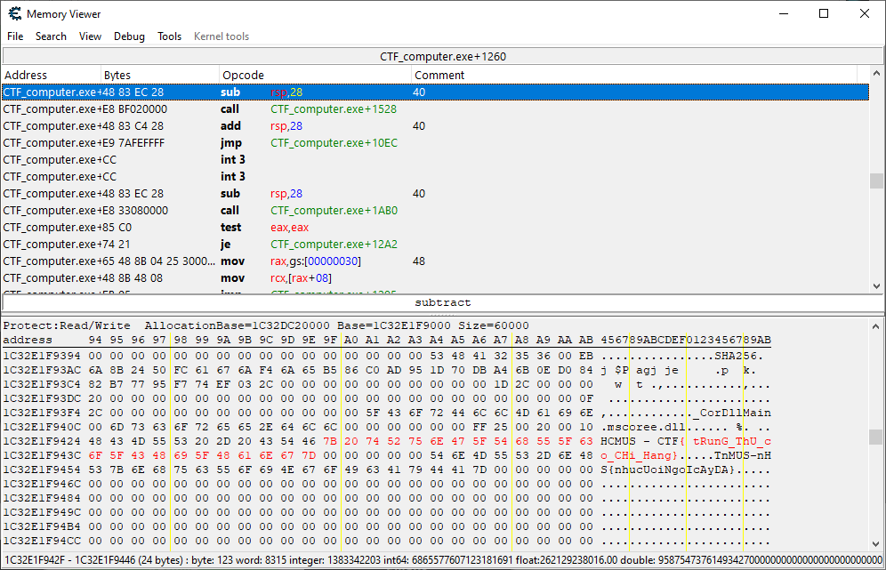

## ⚡ [PressMe](https://ctf.hcmus.edu.vn/challenges#PressMe)

Tác giả: `hvtham`

Tags: `reversing`

### Challenge Description

Đề bài cho một file cài đặt chương trình, sau khi cài đặt xong và chạy thì sẽ hiển thị một phím bấm. Mỗi lần bấm sẽ xuất hiện một ký tự có vẻ như là nằm trong flag cần tìm. Làm thế nào để lấy được flag hoàn chỉnh.

### Summary

Đối với các bài Reversing, chúng ta cần những công cụ để đọc file thực thi, dịch ngược mã nguồn, chạy từng dòng và quan sát RAM, kiểm tra tài nguyên máy ... để truy vết tìm đến nơi lưu trữ flag hoặc thuật toán sinh ra flag. 

### Exploit

Từ những thứ mà chương trình cho, với việc mỗi lần nhấn sẽ xuất hiện 1 ký tự có vẻ nằm trong flag, ta suy đoán flag sẽ được lưu trong RAM để truy xuất ra màn hình. Như vậy công cụ phù hợp ở đây chính là Cheat Engine, dùng để quét những vùng nhớ trong process và tìm kiếm thứ chúng ta cần:

📫 Flag: **`HCMUS-CTF{}`**

---
*[Back to table of contents](../README.md)*
